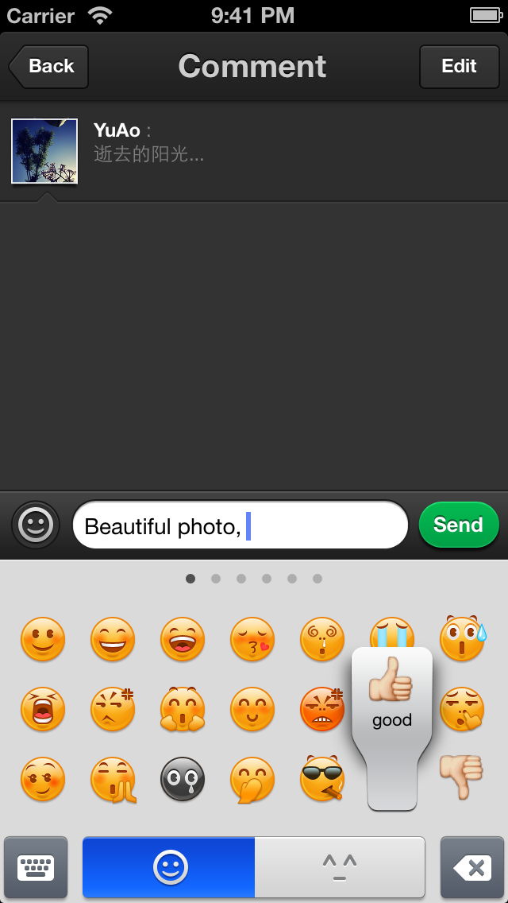
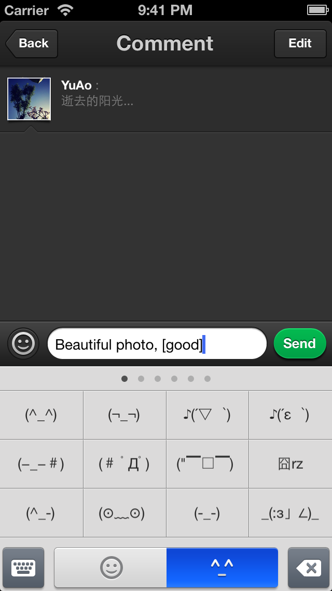

WUEmoticonsKeyboard
===================
Customizable emoticons keyboard for iOS.

WUEmoticonsKeyboard is created under the development of [Weico+](http://plus.weico.com), and is already being used in __[Weico+](http://plus.weico.com) for iOS__'s production code.

 _ 

#Features

1. Fully customizable.
2. UIAppearance support.
3. Easy to build and use.
4. Share the same layout with iOS's Emoji Keyboard.
5. Multiple emotion icon groups support.

#Usage

There's a demo project which shows you how to build and integrate the emotion icon keyboard into your app.

__Note: All the graphical resources and images used in the demo project is COPYRIGHTED (© eico design) and MUST NOT be used in your project.__

#Requirements

1. Automatic Reference Counting (ARC)
2. iOS 6.0+
3. Xcode 4.5+

#Contributing

If you find a bug and know exactly how to fix it, please open a pull request.

If you can't make the change yourself, please open an issue after making sure that one isn't already logged.
